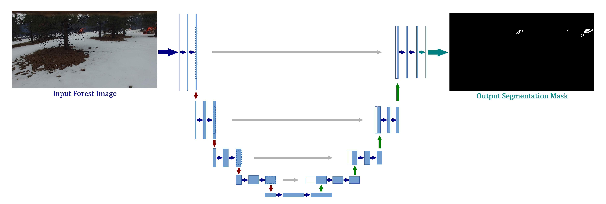

# Forest Fire Detection

Forest fires are natural disasters that pose a major threat to the environment, communities, and ecosystems. Early prediction and detection of forest fires are crucial for mitigating damage and minimizing the efforts required for extinguishing flames. This project uses deep learning techniques to detect forest fires from images.

## Dataset

The dataset used for this project is the FLAME dataset, collected using drones during a controlled burn in Arizona, USA. It consists of approximately 39,375 labeled images in the training set and 8,617 labeled frames in the test set. Additionally, 2,003 frames are labeled for fire segmentation with pixel-level annotations.

The dataset can be accessed from [IEEE Dataport](https://ieee-dataport.org/open-access/flame-dataset-aerial-imagery-pile-burn-detection-using-drones-uavs).

## Model Architecture

The U-Net model is used for the task of fire segmentation in images. U-Net is a convolutional neural network designed for biomedical image segmentation, but its architecture is well-suited for this task due to its ability to capture context and localization information.

The U-Net model has two parts:
1. **Feature Extraction**: Reduces the dimensions of the image while increasing the number of channels.
2. **Mask Construction**: Uses extracted features and some of the original information to construct the segmentation mask.

## Training

The model is trained on the FLAME dataset with images resized to 128x128 pixels. The central crop of the image is selected, resized using Area Sampling for images, and Nearest Neighbors for segmentation masks.

Hyperparameters:
- Image resolution: 128x128
- Batch size: Suitable for maximizing GPU usage
- Epochs: Number of training iterations

Training details and metrics such as mean pixel accuracy (MPA), mean intersection over union (IoU), and frequency weighted intersection over union (fwIoU) are evaluated to measure the performance of the model.

## Results

The U-Net model achieved the following metrics on the test set:
- **mean pixel accuracy**: 99.74%
- **mean intersection over union**: 84.36%
- **frequency weighted intersection over union**: 99.52%

Other relevant metrics taken during multiple experiments are documented in the [research report](docs/Firefighters_Report.pdf).

## Demo

The demo application for this project is implemented in Python using the Gradio library for the user interface and deployment. The key steps involved are as follows:

1. **Model Export**: The trained model is exported into a PyTorch script for faster inference and moved to CUDA for utilizing GPU power.
2. **Inference Function**: This function preprocesses the image, performs inference through the model, and applies postprocessing to the obtained segmentation mask.
3. **Image Resolution**: The images are resized to 720p resolution (1280x720) to demonstrate the model's flexibility with different resolutions.
4. **Deployment**: The application is deployed using Gradio with the parameter `share=True` to deploy the model to the Gradio servers.

You can try the demo application by running the [demo script](demo.py) using the command `python demo.py`. A model is required (replace the path given to the `load_model` function with the one corresponding to the trained model).

## License

This project is licensed under the MIT License - see the [LICENSE](LICENSE) file for details.
